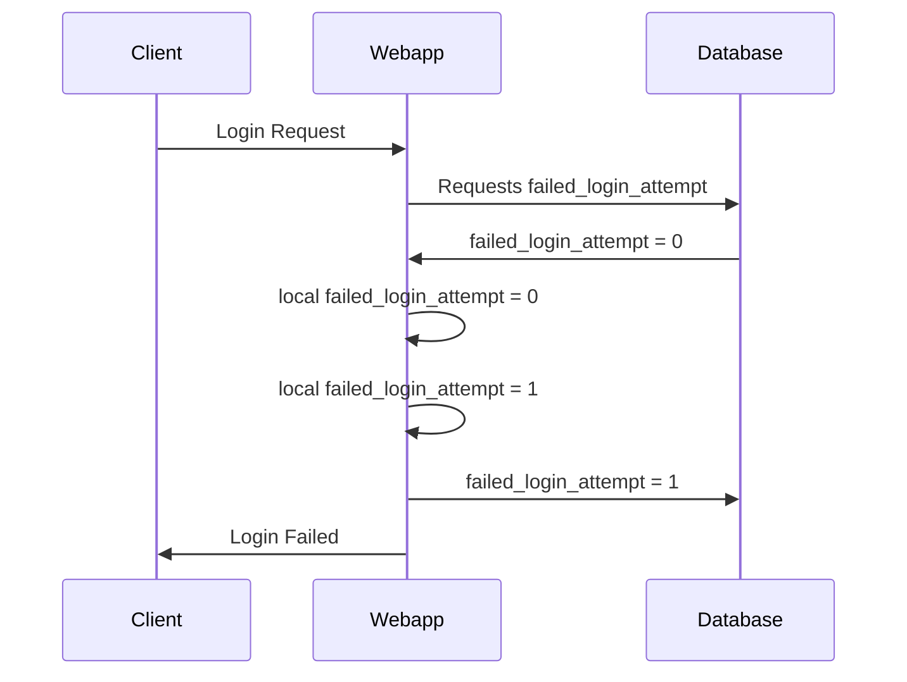
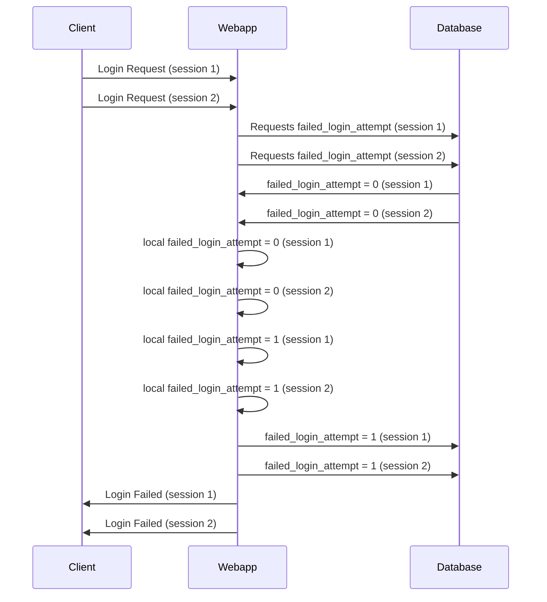

# Proof of concept for CVE-2022-30600 

## Overview  

This repository contains 2 implementations for a proof of concept which exploits CVE-2022-30600. 

CVE-2022-30600 is a security vulnerability which allows an attacker to bypass the account lockout threshold within the moodle webapp. 

As outlined by the following entry in NVD database https://nvd.nist.gov/vuln/detail/CVE-2022-30600, the below versions are known to be vulnerable to this exploit. 

3.9 - 3.9.13 

3.10 - 3.10.10 

3.11 - 3.11.6 

## Attack Details 

As outlined in the commit used to patch this vulnerability, the issue lies with the logic used to access and increment the login_failed_count value in the database.  

https://git.moodle.org/gw?p=moodle.git;a=commitdiff;h=59b5858da200f63ecb59a9113af2b99ef1496fe5;hp=a0f47c8bc4d6f5971025de7d63f22475701d2f86 

If more than 1 concurrent login request occurs, then the moodle webapp may fail to correctly check and update the login value within the application. This results in 2 or more login failures only being counted as 1 login failure. 

To better understand this, the below diagram is a high-level breakdown of a failed login request a client, webapp and database perspective. 

The result is that the failed_login_attempt value in the database is correct and subsequent login attempts will correctly update the value. 

If an attacker sends a number of concurrent login requests. Then the following issue occurs. 

The result of this interaction is that the failed_login_attempt database value is only incremented by 1 despite 2 failed login requests having occurred.  This can be scaled update to hundreds of requests with the limits being how many concurrent requests that the client can make and the number of requests the web server can manage concurrently. 

Furthermore, if an attacker has access to multiple clients(such as botnet) and are able to synchronise the time at which these requests are made, then the attacker can overcome the limitations using one client and make the attack more difficult to mitigate.  

## Python3 implementation 

### Description 

poc.py is the python3 implementation of this attack. It uses threads in order to perform the concurrent requests. Which this proof of concept works, the global interpreter lock present in python3 hinders the benefit of using multiple threads under this circumstance. I strongly recommend using the C++ implementation as it works better when the attack is performed on a single client. 

### Usage 

poc.py [-h] -u USERNAME -url TARGET -w WORDLIST -t THREADS [-a ATTEMPTS] [-d DELAY]

options:
  -h, --help 
  &emsp;shows this help message 
  -u USERNAME, --username USERNAME 
  &emsp;The username of the account being targeted 
  -url TARGET, --target TARGET 
  &emsp;Base URL of the moodle webapp being targeted 
  -w WORDLIST, --wordlist WORDLIST 
  &emsp;The path to the wordlist file being used 
  -t THREADS, --threads THREADS 
  &emsp;The amount of threads created for each attempt 
  -a ATTEMPTS, --attempts ATTEMPTS 
  &emsp;The amount of attempts you would like make. The default is 1  
  -d DELAY, --delay DELAY
  &emsp;This is the amount of seconds between each attempt. The default value is 2 

### Example 

python3 poc.py -u admin -url https://moodle/ -w /usr/share/wordlists/rockyou.txt -t 15 -a 8 

targeting : https://moodle/ 
account username : admin 
wordlist : /usr/share/wordlists/rockyou.txt 
threads : 15 login requests will be made in each attempt 
attempts : the attach will repeat 8 times with a total. 

In this example a total of 120(8 * 15) login requests will be made. There will be a 2 second delay between each attempt

## C++ implementation 

### Description 

poc.cpp is the C++ implementation of the attack which uses the curl library to perform the attack. It therefore, I needs to some compiler flags in order to for the application to compile. Overall this implementation functions better than the python3 version as threads are able to use all cores of the client device allowing for more concurrent connections in a shorter amount of time. This means that the exploit is able to work more consistently.

### Compiler flags

g++ poc.cpp -o poc -lcurl

### Usage 

Usage:
  poc [OPTION...] 
  -a, --attempts   
&emsp;The amount times the attack is performed. 
  -t, --threads   
&emsp;The amount of threads to use in each attempt. 
  -n, --username 
&emsp;The user of the account you are targeting 
  -u, --URL 
&emsp;base URL of the moodle webapp 
  -d, --delay 
&emsp;The time delay between attempts. Default is 5 
  -v, --version 
&emsp;Show the version 
  -h, --help 
&emsp;Display help message 
  -w, --wordlist arg   
&emsp;Wordlist of passwords. 

### Example 

./poc -w /usr/share/wordlists/rockyou.txt -u https://moodle/ -n admin -a 3 -t 5 -d 2 

wordlist : /usr/share/wordlists/rockyou.txt 
URL : https://moodle/ 
account username : admin 
attempts : 3 attempts will be made 
threads : 5 threads will be used in each attempt 
delay : There will be a 2 second delay between each attempt 

## Test environment 

In order to develop, test and debug this scripts I created a virtual machine. This virutal machine used the following software and versions.

Moodle 3.9.0
PHP 7.2.34
MySQL 8.0.30
Ubuntu 5.15.0-41-generic
Apache 2.4.52

## Notice

I do not condone my source code to be used in illegal activity.
